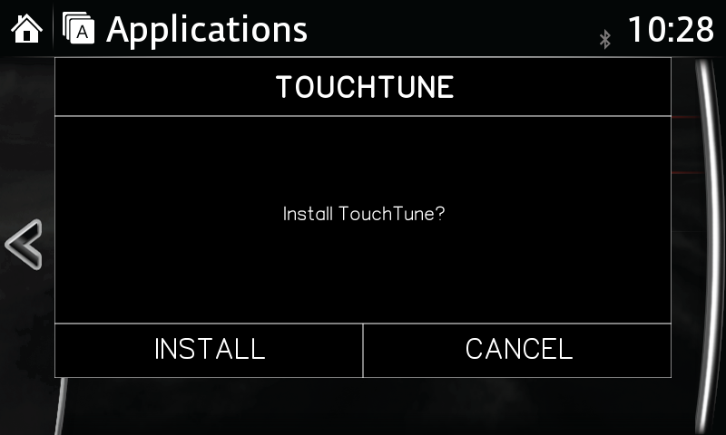

# TouchTune by Miatafy

[](LICENSE)
[](VERSION)
[](#requires-firmware-v7400324a)
[](#supported-vehicles)

TouchTune enables the Mazda Connect touchscreen while the car is moving. 

This repo is the shell script that runs on the head unit (the CMU), to remove the factory speed lockout on firmware **v74.00.324A**.

**Full overview, FAQ, and Mazda Connect guides:** [miatafy.com/touchtune/](https://miatafy.com/touchtune/)

[](https://miatafy.com/touchtune/install/)

*The native TouchTune installer on Mazda Connect. See the [illustrated install guide and
FAQ](https://miatafy.com/touchtune/install/).*

## Contents

- [Requires firmware v74.00.324A](#requires-firmware-v7400324a)
- [Install from a USB stick](#install-from-a-usb-stick)
- [How the USB auto-run works](#how-the-usb-auto-run-works)
- [What ships in patches/ is the install set](#what-ships-in-patches-is-the-install-set)
- [Uninstall with the same USB](#uninstall-with-the-same-usb)
- [Layout](#layout)
- [Built on the MZD-AIO community's work](#built-on-the-mzd-aio-communitys-work)
- [Risks and limits](#risks-and-limits)
- [Supported vehicles](#supported-vehicles)
- [License](#license)

## Requires firmware v74.00.324 / v74.00.324A

Validated only on the Gen 6 Mazda Connect **v74.00.324A build family**. Mazda's About
screen may show `74.00.324` without the package's `A`, especially on EU, 4A, and JP
units. `install-patches.sh` reads the internal `/jci/version.ini`, accepts the exact
`74.00.324` base with an optional `A` patch field, and ignores the region/flavor prefix.
It refuses every other version (v70, v74.00.311, v74.00.331, Gen 7), leaving the unit
untouched. There is no production override.

Check your version first:
[how to check your Mazda Connect firmware](https://miatafy.com/mazda-connect/check-firmware/)
(Settings → System → About). On older firmware, update before installing:
[get to v74](https://miatafy.com/firmware/get-to-v74/) (how to update), and
[what v74 gains](https://miatafy.com/blog/update-mazda-connect-to-v74/).

## Install from a USB stick

The car runs the install itself from a USB stick. There is no desktop app and no login.

1. Format a USB stick **FAT32 (MBR)**. Stick and format details:
   [USB requirements](https://miatafy.com/support/usb-requirements/).
2. Copy the **contents of the `usb/` folder** (not the folder itself) to the root of the
   stick, using `cp -R`, `rsync`, or drag and drop. The stick's root then holds
   `install-patches.sh`, `lib/`, `patches/`, `jci-autoupdate`, and the `$(…).up` launcher.
3. Insert the stick with the car on (engine or accessory) and wait. The head unit detects
   the update flag and opens a TouchTune action dialog. A fresh unit offers **INSTALL**
   or **CANCEL**. If TouchTune is already present, choose **REPAIR**, **REMOVE**, or
   **CANCEL**. On-screen popups track the selected action. When it finishes, it flushes
   the changes, re-enables the watchdog, and restarts the unit. A failed patch stops the
   run without restarting and writes `touchtune.log` to the stick.
4. Leave the USB connected until Mazda Connect reboots and returns to the home screen,
   then remove it. The launcher stays on the stick, so the same USB can repair or remove
   TouchTune later without rebuilding it.

Progress messages stay visible while the installer works; only the initial action dialog
requires input. Wait for Mazda Connect to restart before removing the USB.

On macOS, run `./macos-usb-eject.sh` after copying. It strips the `.DS_Store` and `._*`
files macOS writes to FAT32 and ejects the stick. The `._*` cleanup matters: a stray
`._<launcher>.up` sidecar next to the launcher can make the CMU skip the update.

> **Launcher filename.** The launcher is named `$(...install-patches.sh...).up`. The name
> is valid on FAT32/exFAT/NTFS and copies fine with `cp -R` or drag and drop, but a shell
> will try to execute it if you type it. Copy by wildcard or whole-folder copy, never by
> typing the name.

## How the USB auto-run works

The CMU has a USB update mechanism. Three files on the stick drive it:

- `jci-autoupdate`: an empty flag the head unit's update scanner looks for.
- the `$(…).up` launcher: a small ZIP whose filename is itself a shell command that finds
  and runs `install-patches.sh`.
- `install-patches.sh`: the applier.

On a unit at v74.00.324A, a plain FAT32 USB stick is now the entire
install path: no desktop app, no SSH, no JCI test mode (Mazda closed those), no opening
the dash. Copy the files, plug it in, reboot. The same launcher installs, updates, and
uninstalls.

Plain-English walkthrough of all three:
[how the installer works](https://miatafy.com/blog/how-the-installer-works/).

## What ships in patches/ is the install set

When you choose INSTALL or REPAIR, `install-patches.sh` applies every `*.sh` directly
under `patches/` (no subfolders), sorted by filename, with no separate manifest. Today
that is `patches/touch-while-driving.sh`, a file and nvram edit with nothing to
configure. Add or remove scripts to change the set; if order matters, prefix the
filenames (`01-foo.sh`, `02-bar.sh`) so they sort.

## Uninstall with the same USB

Plug in the same TouchTune USB and choose **REMOVE**. `install-patches.sh` restores every
backed-up file and nvram value, applies nothing, and restarts. No files need to be deleted
from the stick, so a prepared USB remains both the installer and the uninstaller. The
explicit `--restore` command remains available for SSH/off-target maintenance. More on
reverting:
[revert / uninstall](https://miatafy.com/support/revert-uninstall/).

**How the backup works.** Before its first edit, each patched file is copied to
`/data/screentune/backups/files/`, and the copy is never overwritten, so the factory
version stays recoverable. Settings that aren't files use the same scheme: before
`touch-while-driving` clears the CMU's speed-restriction nvram flags, their factory values
are snapshotted to `/data/screentune/backups/nvram/` and written back on restore.

## Layout

`usb/` is the payload. Copy its contents to the USB stick root. The top-level files
(`README`, `LICENSE`, `NOTICE`, `DISCLAIMER`, `macos-usb-eject.sh`) stay in the repo.

```
touchtune/
├── README.md
├── LICENSE
├── NOTICE
├── DISCLAIMER.md
├── macos-usb-eject.sh         macOS helper: strip dotfiles + eject the stick
└── usb/                       Copy the CONTENTS of this folder to the USB root
    ├── install-patches.sh     Applier (the USB launcher's target)
    ├── jci-autoupdate         CMU update flag
    ├── $(…).up                USB launcher (command-injection filename)
    ├── lib/
    │   └── touchtune-helpers.sh   backup/restore (+nvram), ensure_data_dir, finalize
    └── patches/               Every *.sh here is applied (sorted) for INSTALL/REPAIR
        └── touch-while-driving.sh
```

TouchTune writes backups under `/data/screentune/`, the runtime path it shares with
ScreenTune, so installing ScreenTune later reuses the same factory backups instead of
taking a second baseline.

## Built on the MZD-AIO community's work

The `touch-while-driving`
patch descends from [MZD-AIO](https://github.com/Trevelopment/MZD-AIO)'s `01_touchscreen-i`,
and this work is GPL-3.0 because parts of it derive from GPL-3.0 community code. Full
attribution is in [`NOTICE`](NOTICE); background on the lineage:
[ScreenTune vs MZD-AIO](https://miatafy.com/screentune/vs-mzd-aio/).

## Risks and limits

- **No warranty; you assume all risk.** You are modifying a vehicle you own, at your own
  risk (GPL-3.0 sections 15–16). TouchTune is provided as is. By building, installing, or
  using it you accept all risk arising from the modification and its use, and the authors,
  contributors, and Miatafy are not liable for any resulting damage, loss, or injury. The
  backups above are the safety net, and a USB recovery path for a unit that won't boot
  ships with ScreenTune. Full terms: [`DISCLAIMER`](DISCLAIMER.md). See also
  [recovery](https://miatafy.com/firmware/recovery/).
- **It disables a factory safety lockout.** Touch-while-driving is the same change MZD-AIO
  shipped for years, and current cars ship always-on touchscreens. Know what it does and
  keep your eyes on the road. More on the trade-off:
  [safety FAQ](https://miatafy.com/screentune/safety-faq/).
- **Firmware-gated to the v74.00.324A build family.** The About screen may omit the `A`;
  the installer accepts only the exact `.324` base with an optional `A` patch field and
  refuses every other build, as above.
- **Don't disable core services.** `jciVBS`, `jciMMUI`, `audio_manager`, `jciTds`, and
  `jciBootManager` are load-bearing; disabling them breaks the HMI. No patch here touches
  them, and you shouldn't add one that does.

## Supported vehicles

The CMU is shared across Gen 6 Mazda Connect, so TouchTune is eligible on `.324` units
across region labels, including About screens that omit the `A`. It is bench-validated
on a North American ND MX-5 CMU today; other regions and Gen 6 cars (Mazda3, CX-5, and
the rest) use the same build family with validation pending. Full matrix:
[supported vehicles](https://miatafy.com/compatibility/supported-vehicles/).

## License

GPL-3.0-or-later. See [`LICENSE`](LICENSE) and [`NOTICE`](NOTICE). Published by
[Miatafy](https://miatafy.com/about/) ·
[miatafy.com/touchtune](https://miatafy.com/touchtune/).
